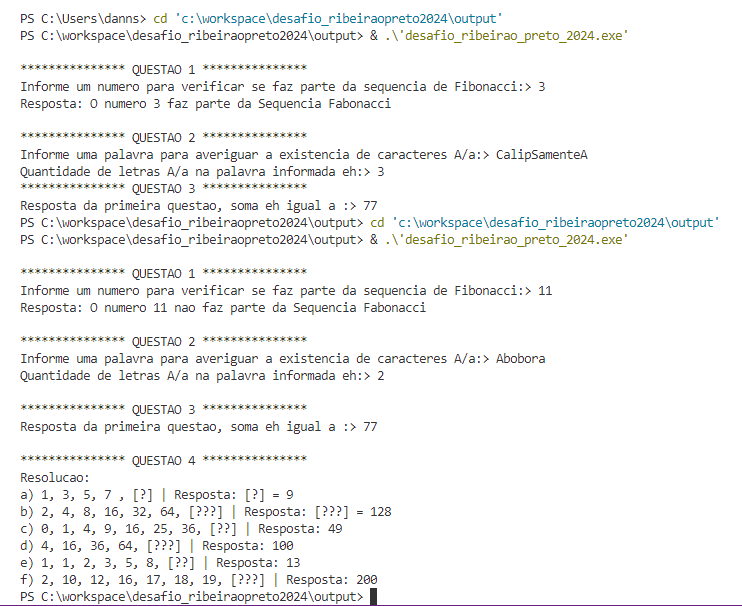
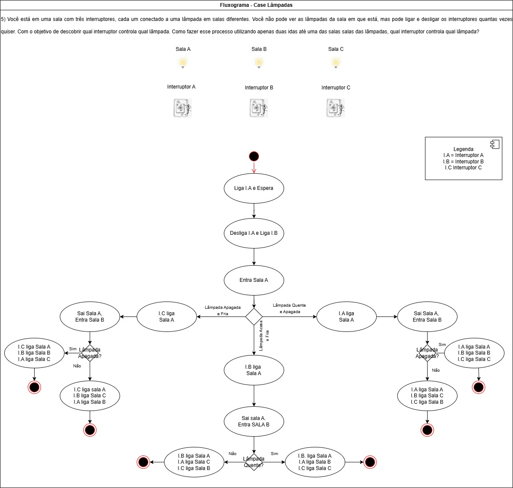

# desafio_ribeiraopreto2024
## Etapa teste do processo seletivo (Estágio) -📚 Processo [Target](https://www.targetsistemas.com.br/sobre)
## Linguagem utilizada: C

#### OutPut 
 🌵

#### ✏ Resolução questão 5:
